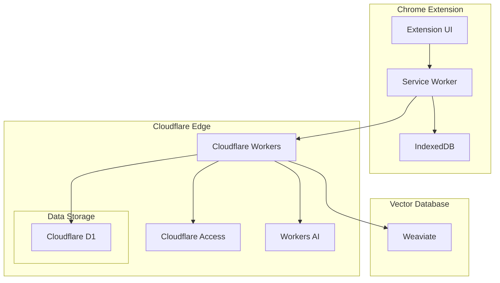

# Design Document: Smart Notes Chrome Extension

## Overview

Smart Notes is a Chrome extension that enables users to efficiently manage tasks and notifications and notes through a combination of direct entry and natural language interaction. The system leverages modern cloud technologies, specifically the Cloudflare ecosystem, to provide a responsive, secure, and intelligent task management experience.

The extension will be built using React for the frontend UI components, WXT as the Chrome extension framework, and will utilize Cloudflare Workers for serverless backend functionality. Data will be stored in Cloudflare D1 database with Vector Extension for semantic search capabilities, and AI features will be powered by Cloudflare Workers AI.

## Architecture

The system follows a client-server architecture with the following components:

### Client-Side (Chrome Extension)
- **Extension UI**: React-based interface for task entry and chat interaction
- **Local Storage**: IndexedDB for offline functionality and caching
- **Service Worker**: Manages background processes and notifications
- **State Management**: React Context API or Redux for state management

### Server-Side (Cloudflare Workers)
- **API Layer**: RESTful endpoints for CRUD operations on tasks and user data
- **Authentication Service**: Integration with Cloudflare Access
- **Vector Processing Service**: Processes text for vector embeddings
- **RAG Engine**: Retrieval Augmented Generation for intelligent responses

### Data Layer
- **Relational Database**: Cloudflare D1 for structured data storage
- **Vector Database**: Weaviate for semantic search capabilities



## Components and Interfaces

### 1. Extension UI Components

#### Popup Interface
- **Login Component**: Handles user authentication
- **Combined Input Interface**: Unified area for both task entry and chat interactions
- **Task List Component**: Displays saved tasks with filtering options

#### Background Components
- **Service Worker**: Manages extension lifecycle, notifications, and offline sync
- **Storage Manager**: Handles local data persistence and synchronization

### 2. Backend API Endpoints

#### Authentication Endpoints
- `POST /auth/login`: Authenticates user via Cloudflare Access
- `POST /auth/logout`: Ends user session
- `GET /auth/status`: Checks authentication status

#### Task Management Endpoints
- `GET /tasks`: Retrieves tasks with optional filters
- `POST /tasks`: Creates a new task
- `PUT /tasks/:id`: Updates an existing task
- `DELETE /tasks/:id`: Removes a task

#### Chat Endpoints
- `POST /chat/query`: Processes natural language queries and returns relevant tasks
- `GET /chat/history`: Retrieves conversation history

### 3. Data Processing Pipeline

#### Task Processing Flow
1. User enters task in the combined input interface
2. Client validates and formats task data
3. Task is sent to backend API
4. Backend stores task in D1 database
5. Text is processed for vector embedding
6. Vector embedding is stored in vector database
7. Confirmation is returned to client

#### Query Processing Flow
1. User enters query in the combined input interface
2. Query is sent to backend API
3. Backend processes query using Workers AI
4. Vector search is performed to find relevant tasks
5. Results are formatted and returned to client
6. Client displays results in the conversation view

## Data Models

### User Model
```typescript
interface User {
  id: string;
  email: string;
  name: string;
  created_at: Date;
  last_login: Date;
}
```

### Task Model
```typescript
interface Task {
  id: string;
  user_id: string;
  content: string;
  date: Date;
  completed: boolean;
  priority: 'low' | 'medium' | 'high';
  tags: string[];
  created_at: Date;
  updated_at: Date;
}
```

### Chat Message Model
```typescript
interface ChatMessage {
  id: string;
  user_id: string;
  session_id: string;
  content: string;
  role: 'user' | 'system';
  timestamp: Date;
}
```

### Vector Embedding Model
```typescript
interface VectorEmbedding {
  id: string;
  task_id: string;
  embedding: number[];
  created_at: Date;
}
```

## Database Schema

### D1 Tables

#### Users Table
```sql
CREATE TABLE users (
  id TEXT PRIMARY KEY,
  email TEXT UNIQUE NOT NULL,
  name TEXT,
  created_at TIMESTAMP DEFAULT CURRENT_TIMESTAMP,
  last_login TIMESTAMP
);
```

#### Tasks Table
```sql
CREATE TABLE tasks (
  id TEXT PRIMARY KEY,
  user_id TEXT NOT NULL,
  content TEXT NOT NULL,
  date TIMESTAMP NOT NULL,
  completed BOOLEAN DEFAULT FALSE,
  priority TEXT CHECK(priority IN ('low', 'medium', 'high')),
  tags TEXT,
  created_at TIMESTAMP DEFAULT CURRENT_TIMESTAMP,
  updated_at TIMESTAMP DEFAULT CURRENT_TIMESTAMP,
  FOREIGN KEY (user_id) REFERENCES users(id)
);
```

#### Chat Messages Table
```sql
CREATE TABLE chat_messages (
  id TEXT PRIMARY KEY,
  user_id TEXT NOT NULL,
  session_id TEXT NOT NULL,
  content TEXT NOT NULL,
  role TEXT CHECK(role IN ('user', 'system')),
  timestamp TIMESTAMP DEFAULT CURRENT_TIMESTAMP,
  FOREIGN KEY (user_id) REFERENCES users(id)
);
```

#### Weaviate Schema
```json
{
  "class": "Task",
  "properties": [
    {
      "name": "content",
      "dataType": ["text"]
    },
    {
      "name": "taskId",
      "dataType": ["string"],
      "indexFilterable": true,
      "indexSearchable": true
    },
    {
      "name": "userId",
      "dataType": ["string"],
      "indexFilterable": true
    },
    {
      "name": "date",
      "dataType": ["date"],
      "indexFilterable": true
    },
    {
      "name": "completed",
      "dataType": ["boolean"],
      "indexFilterable": true
    },
    {
      "name": "priority",
      "dataType": ["string"],
      "indexFilterable": true
    },
    {
      "name": "createdAt",
      "dataType": ["date"],
      "indexFilterable": true
    }
  ],
  "vectorizer": "text2vec-transformers"
}
```

## Error Handling

### Client-Side Error Handling
- Form validation errors with clear user feedback
- Network error detection and retry mechanisms
- Offline mode detection and appropriate UI updates
- Graceful degradation when features are unavailable

### Server-Side Error Handling
- Structured error responses with appropriate HTTP status codes
- Detailed logging for debugging and monitoring
- Rate limiting to prevent abuse
- Fallback mechanisms for AI service disruptions

### Error Response Format
```typescript
interface ErrorResponse {
  status: number;
  message: string;
  details?: string;
  code?: string;
}
```

## Authentication Flow

1. User clicks login button in extension
2. Extension redirects to Cloudflare Access login page
3. User authenticates with their credentials
4. Cloudflare Access validates the user and issues a JWT
5. JWT is stored securely in the extension
6. JWT is included in all subsequent API requests
7. Backend validates JWT for each request
8. When JWT expires, user is prompted to re-authenticate

## Testing Strategy

### Unit Testing
- Component tests for UI elements using React Testing Library
- Function tests for utility functions and helpers
- API endpoint tests using mock requests

### Integration Testing
- End-to-end tests for critical user flows
- API integration tests with mock database
- Authentication flow testing

### Performance Testing
- Load testing for API endpoints
- Response time measurements for critical operations
- Memory usage monitoring in extension

### Security Testing
- Authentication and authorization tests
- Data encryption verification
- Input validation and sanitization tests

## Offline Functionality

The extension will implement the following strategies for offline support:

1. **Local Storage**: Tasks and user data will be cached in IndexedDB
2. **Sync Queue**: Changes made offline will be queued for synchronization
3. **Conflict Resolution**: Server-side conflict resolution for simultaneous edits
4. **Status Indicators**: Clear UI indicators for offline status and pending syncs

## UI Mockups

### Extension Popup Interface

```
+-----------------------------------------------+
|  Smart Notes                         [⋮] [×]  |
+-----------------------------------------------+
|                                               |
|  +-------------------+  +-----------------+  |
|  | Today             |  | All Tasks       |  |
|  +-------------------+  +-----------------+  |
|                                               |
|  [ ] Meeting with team at 2pm                 |
|      Priority: High   |   Today               |
|                                               |
|  [ ] Submit project proposal                  |
|      Priority: Medium |   Tomorrow            |
|                                               |
|  [ ] Call John about the contract             |
|      Priority: Low    |   Jul 20              |
|                                               |
+-----------------------------------------------+
|                                               |
|  What would you like to do?          [Send]   |
|  [_____________________________]      [🗓️]    |
|                                               |
+-----------------------------------------------+
```

### Conversation View

```
+-----------------------------------------------+
|  Smart Notes                         [⋮] [×]  |
+-----------------------------------------------+
|                                               |
|  You: What tasks do I have tomorrow?          |
|                                               |
|  Smart Notes: You have 2 tasks scheduled for  |
|  tomorrow:                                    |
|                                               |
|  1. Submit project proposal (Medium priority) |
|  2. Review marketing materials (Low priority) |
|                                               |
|  You: Add a meeting with Sarah at 3pm         |
|  tomorrow                                     |
|                                               |
|  Smart Notes: I've added "Meeting with Sarah" |
|  to your tasks for tomorrow at 3:00 PM.       |
|                                               |
|  Would you like to set a priority?            |
|                                               |
+-----------------------------------------------+
|                                               |
|  What would you like to do?          [Send]   |
|  [_____________________________]      [🗓️]    |
|                                               |
+-----------------------------------------------+
```

### Login Screen

```
+-----------------------------------------------+
|  Smart Notes                         [⋮] [×]  |
+-----------------------------------------------+
|                                               |
|                 Smart Notes                   |
|                                               |
|          Your intelligent task manager        |
|                                               |
|                                               |
|                                               |
|                                               |
|         [Sign in with Cloudflare Access]      |
|                                               |
|                                               |
|                                               |
|                                               |
+-----------------------------------------------+
```

## Performance Considerations

1. **Lazy Loading**: Components will be loaded on demand to reduce initial load time
2. **Caching**: Frequently accessed data will be cached locally
3. **Debouncing**: Input events will be debounced to reduce API calls
4. **Pagination**: Large data sets will be paginated to improve performance
5. **Compression**: Data will be compressed when appropriate to reduce bandwidth

## Security Considerations

1. **Authentication**: Secure authentication via Cloudflare Access
2. **Data Encryption**: Sensitive data will be encrypted at rest
3. **HTTPS**: All API communications will use HTTPS
4. **Content Security Policy**: Strict CSP to prevent XSS attacks
5. **Permission Model**: Minimal required permissions for Chrome extension
6. **Input Validation**: Thorough validation of all user inputs
7. **Rate Limiting**: API rate limiting to prevent abuse